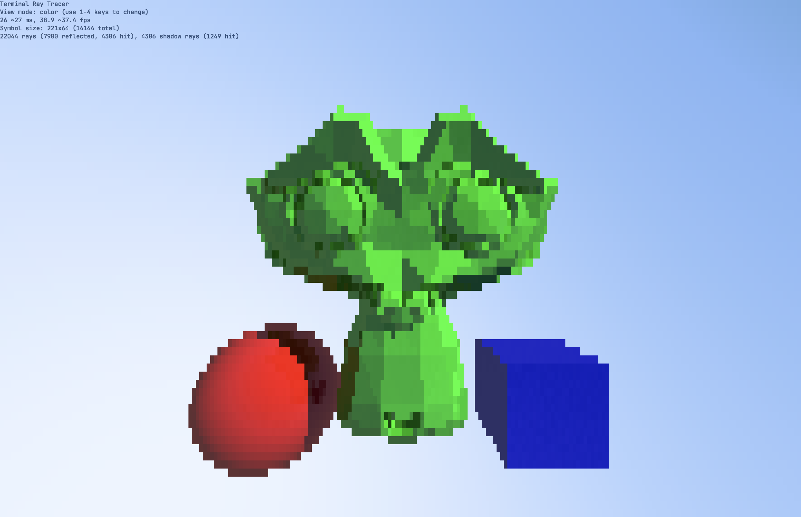

# Terminal Ray Tracer



A simple ray tracer that runs directly in terminal and uses CPU only.

Coloring is done with ANSI escape codes. The only supported mode is 24-bit
TrueColor.

Frame rate highly depends on terminal printing speed. The one I use is
[Alacritty](https://github.com/alacritty/alacritty). It gives me about 38 FPS
for 205x64 symbol size on Apple M3. GNOME's Console (kgx) is about 24 FPS on
Intel i5-12400F.

The scene consists of an AABB (axis-aligned bounding box), one sphere, and a
triangular Suzanne. Triangular objects testing is optimized with enclosing
AABB. `suzanne.obj` is generated via Blender. Triangulation is applied to
simplify ray intersection implementation requirements.

This hobby project is done to prototype basic ray tracing without GPU
programming complexity and to practice in Rust. It only depends on
[libc](https://github.com/rust-lang/libc) to retrieve terminal sizes and
generate random values.

## How to run

```sh
cargo install --git https://github.com/daniilgankov/terminal-ray-tracer
terminal-ray-tracer
```

Be sure to have `~/.cargo/bin` in your `PATH`.

Run without installing:

```sh
git clone https://github.com/daniilgankov/terminal-ray-tracer
cd terminal-ray-tracer
cargo run -r
```

Or use Docker container if you do not have Rust:

```sh
docker build .
docker run -it --log-driver none $(docker build -q .)
```

This program _should_ work on Windows but it is not tested.

Hint for Unix users: if program exits unexpectedly, run `reset` to restore
terminal.

## Controls

Vim's `hjkl` to move camera left, down, up, and right.

`1` to `4` to change drawing mode respectively:

- color: the final color presentation,
- normal: normal direction is normalized and bound to color,
- depth: depth ratio is bound to color,
- complexity: traced ray count to the maximum ratio is bound to temperature
  palette.

Esc or `q` to exit.

## References

- <https://en.wikipedia.org/wiki/M%C3%B6ller%E2%80%93Trumbore_intersection_algorithm>
- <https://en.wikipedia.org/wiki/Machine_epsilon>
- <https://en.wikipedia.org/wiki/Minimum_bounding_box>
- <https://en.wikipedia.org/wiki/UTF-8#Description>
- <https://gist.github.com/fnky/458719343aabd01cfb17a3a4f7296797>
- <https://raytracing.github.io/books/RayTracingInOneWeekend.html>
- <https://wiki.archlinux.org/title/Linux_console>
- <https://www.scratchapixel.com/lessons/3d-basic-rendering/minimal-ray-tracer-rendering-simple-shapes/ray-box-intersection.html>
- <https://www.scratchapixel.com/lessons/3d-basic-rendering/minimal-ray-tracer-rendering-simple-shapes/ray-sphere-intersection.html>
- <https://www.scratchapixel.com/lessons/3d-basic-rendering/ray-tracing-rendering-a-triangle/barycentric-coordinates.html>
- <https://www.scratchapixel.com/lessons/3d-basic-rendering/ray-tracing-rendering-a-triangle/moller-trumbore-ray-triangle-intersection.html>
